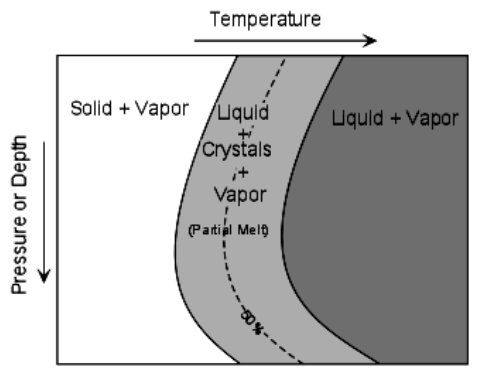

<!--
-------------------------------------------------------------------------------
This file defines the contents of each slide.
The reveal.js configuration can be found in index.html
-------------------------------------------------------------------------------
-->

<!-- .slide: class="slide-title" data-background-image="assets/background-faded.svg" data-background-color="#000000" data-background-size="contain" -->

<!-- Place the content at the bottom of the slide -->

<h1 id="talk-title">
  Litosfera: Química e Geofísica
</h1>

  <a>Yago Moreria Castro</a>

<!-- Place location and date side-by-side with affiliation logos -->

<i class="fa fa-calendar-alt" style="margin: 0 10px 0 0"></i>
11 de Junho de 2024

Seminário de Introdução à Tectônica Global

<!-- Permission to reuse and CC-BY license logo -->
<i class="fa fa-camera" style="margin: 0 10px 0 0"></i>
Sinta-se à vontade para tirar capturas de tela/compartilhar/reutilizar esta apresentação

<a href="https://creativecommons.org/licenses/by/4.0/"><i class="fab fa-creative-commons"></i><i class="fab fa-creative-commons-by" style="margin: 0 10px 0 2px"></i>CC-BY 4.0 License</a>

<!-- Add logos here. Need these wrappers to align them to the bottom right -->

  
  

===============================================================================

# Modelos da Estrutura Interna da Terra

===============================================================================

# Modelos da Estrutura Interna da Terra

===============================================================================

# Placas Litosféricas

===============================================================================

# Litosfera

- Etimologia ⇒ Lithos (pedra) + sphaira (esfera)
- Camada externa rígida e móvel que inclui crosta e pacela do manto superior;
- Resultado do resfriamento da porção externa do globo terrestre;
- Alterada por agentes externos e internos;
- Espessura
  -  ~100 km em bacias oceânicas;
  - 100 km - 200 km em bacias continentais

===============================================================================

# Composição química geral da litosfera

<section>
	<table >
    	<thead><tr>
            <th>Principais Elementos na Litosfera</th>
            <th>% em massa</th>
        </tr></thead>
        <tbody>
          <tr>
            <td>$O$</td>
            <td>49.2</td>
          </tr>
          <tr>
            <td>$Si$</td>
            <td>25.7</td>
          </tr>
          <tr>  
            <td>$Al$</td>
            <td>7.5</td>
          </tr>
          <tr>  
            <td>$Fe$</td>
            <td>4.7</td>
          </tr>
          <tr>  
            <td>$Ca,Na,K,Mg,H,Ti,Cl$ ...</td>
            <td>~12</td>
        </tr>
        </tr></tbody>
    </table>
</section>

===============================================================================

# Crosta Oceânica

- Resultante da fusão parcial do peridotito do manto superior (devido à descompressão adiabática), seguida pela cristalização na câmara magmática;

  

    
  

  
  
    
  

===============================================================================

  # Estrutura da crosta oceânica

  

===============================================================================

# Crosta Continental

- Composição global: andesítica (rocha ígnea intermediária)

    

===============================================================================

# Crosta Continental

  

    
  

  
  
    
  

===============================================================================

# Manto

- $FeO$, $MgO$ e $SiO_2$  representam mais de 90%;

    

===============================================================================

# Manto

  

- Mineralogia varia de acordo com a pressão;

- Fases com Alumínio:
    - Plagioclásio peridotito (< 50 km);
    - Espinélio peridotito (50 km - 80 km);
    - Granada peridotito (80 km - 400 km).

  

  

      
  

===============================================================================

# Zona de Baixa Velocidade (LVZ)

- Depende de processos de fusão;
- São avaliados Diagramas de Fase de Sistemas Silicáticos

===============================================================================

# Diagramas de Fase de Sistemas Silicáticos

  

- Em sistemas anidros e sob condições normais de temperatura, as geotermas não cruzam a curva do solidus;
- A LVZ é raramente presente sob litosfera continental.

  

  

      
  

===============================================================================
# Fusão por Aumento de Temperatura

  

===============================================================================
# Fusão por Efeito de Voláteis

  

===============================================================================
# Fusão por Alívio de Pressão

  

===============================================================================
# Geração de Magma Basáltico

  

===============================================================================

# Diagramas de Fase de Sistemas Silicáticos

  

      
  

  

      
  

===============================================================================

# Geofísica
- A maior parte dos métodos geofísicos investiga, de maneira direta ou indireta, a litosfera:
    - Dados sísmicos;
    - Dados gravimétricos;
    - Dados magnetométricos.
- Abordaem direta: dados geoquímicos e furos de sondagem.

===============================================================================

# Características físicas da litosfera

- A litosfera carrega consigo uma conotação de frieza, alta viscosidade, permanência, resistência ao fluxo e uma relação com a crosta sobrejacente (Anderson, 1995).
- A litosfera é geralmente assumida ter viscosidades 2 ou 3 ordens de magnitude mais altas que as encontradas na astenosfera (Anderson, 1995).
- Resiste a pressões de ~1 kbar durante período superior a $10^9$ anos;
- Litosfera é relativamente fria;
- Maior parte do calor na litosfera é transferido por pelo processo de condução;

===============================================================================

# Características Físicas da Litosfera

  

- 
Perfis atuais de velocidade sísmica mostram uma diminuição abrupta na velocidade de cisalhamento em profundidades que variam de aproximadamente 10 a 20 km sob oceanos jovens até aproximadamente 150-200 km sob crátons (Anderson, 1995).

  

  

      
  

===============================================================================

# Características Físicas da Litosfera

  

- Isso implica uma mudança de fase:
    - Desidratação ou fusão parcial;
    - Mudança na composição ou mineralogia;
    - Aumento no estresse ou densidade de deslocamento;
    - Aumento muito rápido no gradiente de temperatura.
  

  

      
  

===============================================================================

# Investigação da Descontinuidade de Mohorovičić

  

## Diferença entre conceitos

- Sísmica: interface entre gabros e peridotitos acamados;
- Petrológica: interface entre peridotitos acamados e não acamados.
  

  

      
  

===============================================================================

  

===============================================================================
## Crustal thickness map of Brazil: Data compilation and main features
- O mapa de espessura crustal é baseado em uma compilação de dados publicados e novas medições.
- As fontes de dados incluem conjuntos de dados sísmicos de experimentos de refração sísmica profunda, análises de funções receptoras e velocidades de dispersão de ondas de superfície.
- As espessuras crustais derivadas de anomalias gravitacionais dependem de suposições, como contraste de densidade constante através da interface do Moho.

===============================================================================

# Investigação da Descontinuidade de Mohorovičić

  

      
  

  

    

      Fig. 1. Distribuição dos pontos de dados de perfis de refração/reflexão sísmica (cruzes) e estações com função receptora (círculos), coloridos de acordo com o número, “N”, de diferentes medições. Círculo aberto: apenas uma medição da espessura da crosta; cinza: duas ou três medições; sólido: quatro a sete medições. As principais províncias geológicas são coloridas por crátons (rosa, C), cinturões de dobramentos Neoproterozóicos (cinza, FB) e bacias intracratônicas (amarelo, B). GS, CBS = escudos da Guiana e do Brasil Central do cráton Amazônico; SFC = cráton São Francisco; Bb, To e Rb são os cinturões de dobramentos Borborema, Tocantins e Ribeira, respectivamente; Bacias intracratônicas: Am = Solimões e Amazonas; Pn = Parnaíba, Pc = Parecis, Pt = Pantanal (sobreposto ao cinturão de dobramentos Araguaia), Pr = Paraná, Ch = Chaco.
    

  

===============================================================================

# Investigação da Descontinuidade de Mohorovičić

  

      
  

  

    

      Fig. 6. Variações na espessura da crosta na área continental estável (principalmente Brasil) e nas principais províncias geológicas. Círculos cinza denotam espessura normal da crosta (36,5 a 41,5 km); vermelho denota crosta mais espessa que 41,5 km, verde entre 36,5 e 31,5 km, azul mais fina que 31,5 km. Tons mais claros de azul ou vermelho denotam incertezas maiores que 3 km. Linhas sólidas grossas no oceano são o limite da crosta continente-oceano; linha fina é a batimetria de 200 m. Províncias geológicas conforme a Fig. 1.
    

  

===============================================================================

# Investigação da Descontinuidade de Mohorovičić

  

      
  

  

    

      Fig. 12. Mapa de contorno da espessura crustal (km). Pontos vermelhos mostram dados sísmicos (dados de função receptora e refração/reflexão). Cruzes brancas nas áreas oceânicas denotam espessuras inferidas por anomalias de Bouguer (Fig. 11). Pontos brancos nos Andes e regiões sub-andinas denotam espessuras fornecidas pela modelagem gravimétrica restrita por dados sísmicos de Tassara e Echaurren (2012). Linhas verdes são os limites das principais províncias geológicas brasileiras. Os valores de espessura crustal no oceano incluem a camada de água.
    

  

===============================================================================

<!-- .slide: class="slide-contact" data-background-image="assets/background-faded.svg" data-background-size="contain" data-background-color="#000000" -->

<i class="fas fa-comments"></i>
 
Contato:
<a href="yagomcastro@usp.br">yagomcastro@usp.br</a>

<i class="fab fa-github"></i>
 
Código-fonte para esta apresentação:
 
[github.com/YagoMCastro/tectonica-litosfera-seminario1-msc-2024](https://github.com/YagoMCastro/tectonica-litosfera-seminario1-msc-2024)

<i class="fab fa-creative-commons"></i><i class="fab fa-creative-commons-by"></i>
 

Salvo indicação em contrário,
o conteúdo desta apresentação está
licenciado sob a
 
[Creative Commons Attribution 4.0 International License](https://creativecommons.org/licenses/by/4.0/).

